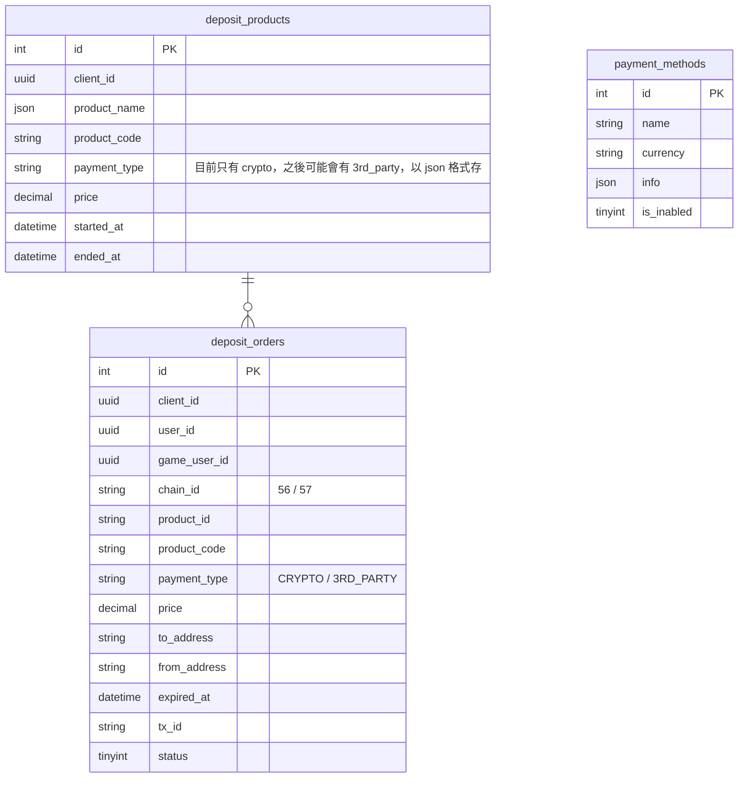

# Deposit ERD

## 重要狀態 / 類型列表

### tbl.deposit_orders
| 用途 | 欄位 | 紀錄 | 常數 | 說明 |
| --- | --- | --- | --- | --- |
| 訂單狀態 | status | PENDING | 0 | [`default`] 新建立 |
||| ITEM_RECEIVED | 1 | 遊戲收到道具 |
||| PAID_SYSTEM | 2 | 收到 cybavo 付款完成 callback |
||| PAID_MANUALLY | 3 | 爭議款項，透過後端手動將訂單調整為已付款 |
||| CALLING_BACK | 4 | 付款完成，等待遊戲回覆是否收到道具 |
||| CANCELLED_SYSTEM | 10 | call Cybavo API 取消訂單 |
||| CANCELLED_MANUALLY | 11 | 因 error 而後端手動取消訂單 |
||| EXPIRED | 12 | 訂單過期 |
||| ERROR_DEPOSIT_SHORTAGE | 13 | 付款不足額導致錯誤 |
||| ERROR_DEPOSIT_EXCESS | 14 | 付款超額導致錯誤 |
||| CALLBACK_FAIL | 15 | 通知遊戲5次後仍失敗 |