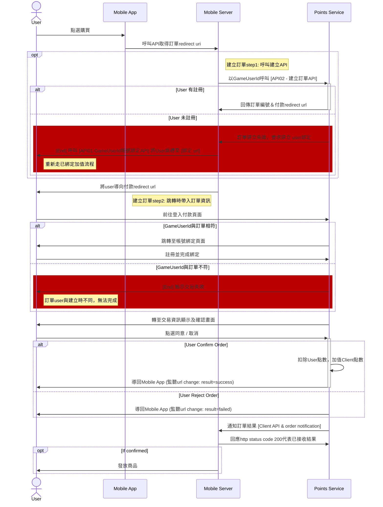

# Metasens Points Service API List

## 開發路線

|          | way1 | way2 | way3 |
| ---------- | ------------------------------------------------------------------------------------- | ------------------------------------------------------------------------ | :--------------------------------------------------------------------------- |
| 情境 | <ul><li>遊戲方有能力串接</li><li>遊戲方無自有API</li><li>Metasens團隊遊戲</li></ul> | <ul><li>遊戲方已有API</li><li>遊戲方無法 / 不願串接 (代理商)</li></ul> | <ul><li>遊戲方已有API</li><li>遊戲方無法 / 不願串接 (代理商)點數</li></ul> |
| 會員認證 | 遊戲方串接 | Metasens方串接 | 遊戲方串接 |
| 點數交換 | 遊戲方串接 | Metasens方串接 | Metasens方串接 |
| Note | <ul><li>原始思考方向</li><li>可能最先開發給Metasens團隊遊戲串接</li><li>需有串接引導人力</li></ul>                                                                   | <ul><li>討論中，Pongo那邊聽來的，未經證實</li><li>需額外開發兌換平台</li><li>需有串接開發人力</li></ul> | <ul><li>討論中，Pongo那邊聽來的，未經證實</li><li>需額外開發兌換平台</li><li>需有串接開發人力</li><li>較way2合理</li></ul> |

---

##  [遊戲方串接] Flow - Deposit

+ **需要先完成綁定才能進行交易。**
+ 以 `gameUserId` 作為交易對象憑證，用以減少user登入次數，避免降低體驗。
+ 在deposit的情境最多僅需一次跳離遊戲的綁定動作。

```mermaid
  sequenceDiagram
    autonumber
    Actor User

    Mobile App       ->> Mobile Server : 呼叫server要求加點
    Mobile Server    ->>+ Points Service: [API02 - 建立訂單API] 以OrderId & GameUserId呼叫 


    rect rgb(0,0,0) 
      alt GameUserId已綁定
        Points Service   ->> Points Service: 建立訂單，扣除Client點數，加值User點數
        Points Service   ->>- Mobile Server : 回應成功訊息及我方OrderId
  
        Mobile Server    ->> User          : 通知user，End
      else GameUserId未綁定
        Points Service   ->> Mobile Server : 回傳未綁定之失敗訊息
        Mobile Server    ->> User          : 呼叫 [API01-GameUserId帳號綁定API] 將User跳轉至綁定 url
        Note right of User                 : 重新走已綁定加值流程
      end
    end
```

---

## [遊戲方串接] Flow - Withdraw

**需要先完成綁定才能進行交易。**

+ 在 `withdraw` 扣款的流程裡，加入了metasens扣款同意頁面，以避免遊戲方會單方面進行扣款。
+ 簡易交易流程說明：
  1. 雙方server建立訂單
  2. 使用者跳轉並且同意
  3. 我方server通知對方server交易完成

---

## APIs

### server to server
1. GameUserId帳號綁定API
1. client方串接用
   1. 建立deposit訂單API
      - [POST] `{API Url}/v1/deposit`
   2. 建立withdraw訂單API
   3. 查詢訂單狀態API
   4. `optional` user餘額與交易紀錄查詢
   5. `optional` client餘與交易紀錄查詢
2. client開發
3. Signature

### redirect page
1. 遊戲方串接用
   1. GameUserId綁定redirect uri
   2. client user 訂單同意頁面 redirect uri [anchor test](#route)

### cronjob / command

1. order notification
   1. 遊戲server需配合開發通知接收API
2. client top up command

