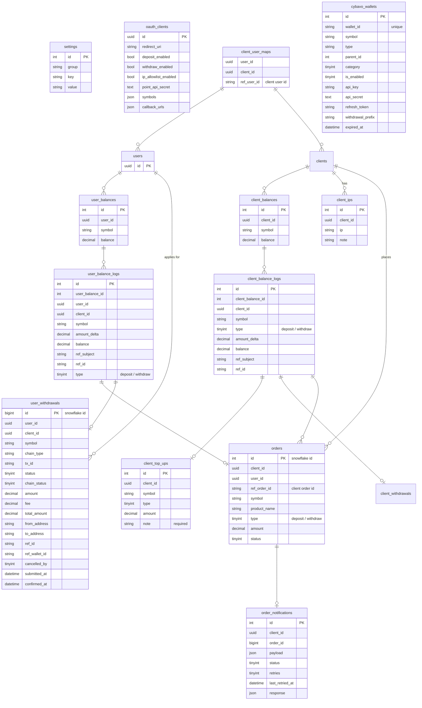

# Points ERD

## Q
1. tables是否應帶 module ?
2. point_client 與 oauth_clients 是否應該分開？
3. balances是否放一起？
   

## 重要狀態 / 類型列表

### tbl.orders

| 用途 | 欄位 | 常數 | 紀錄 | 說明 |
| --- | --- | --- | --- | --- |
| 訂單狀態 | status | NEW | 0 | [`default`] 新建立 |
||| COMPLETE | 1 | 訂單完成 |
||| CANCELLED | 10 | 取消 |
