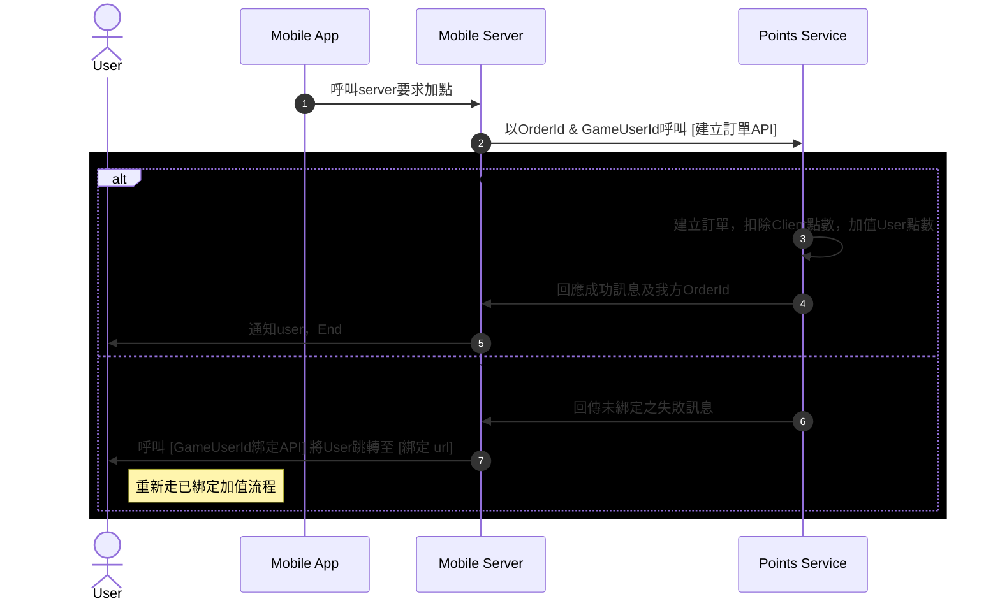
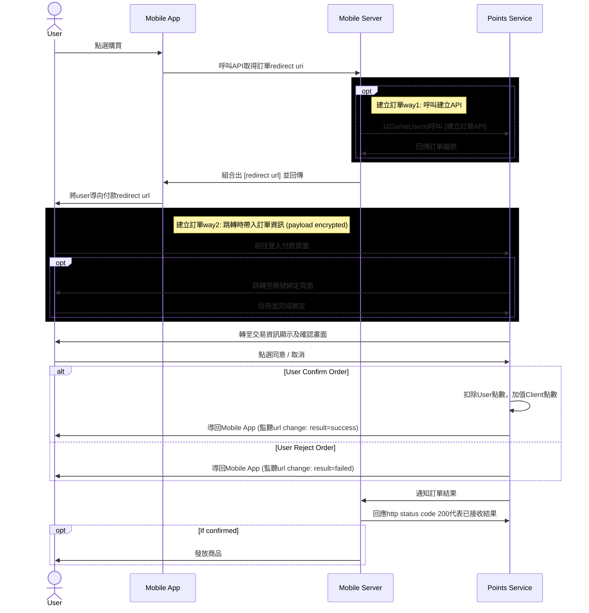
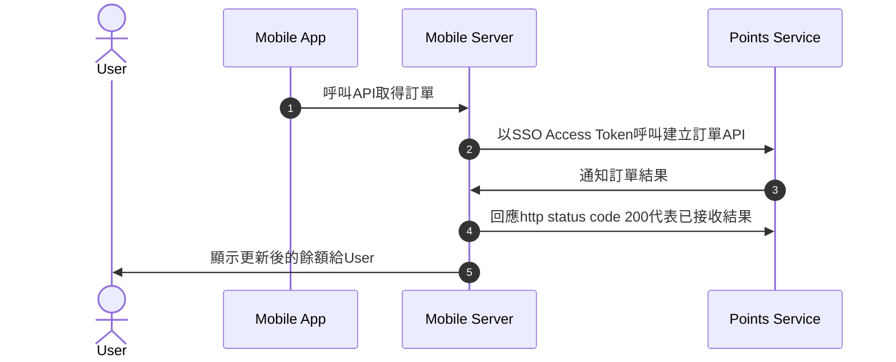
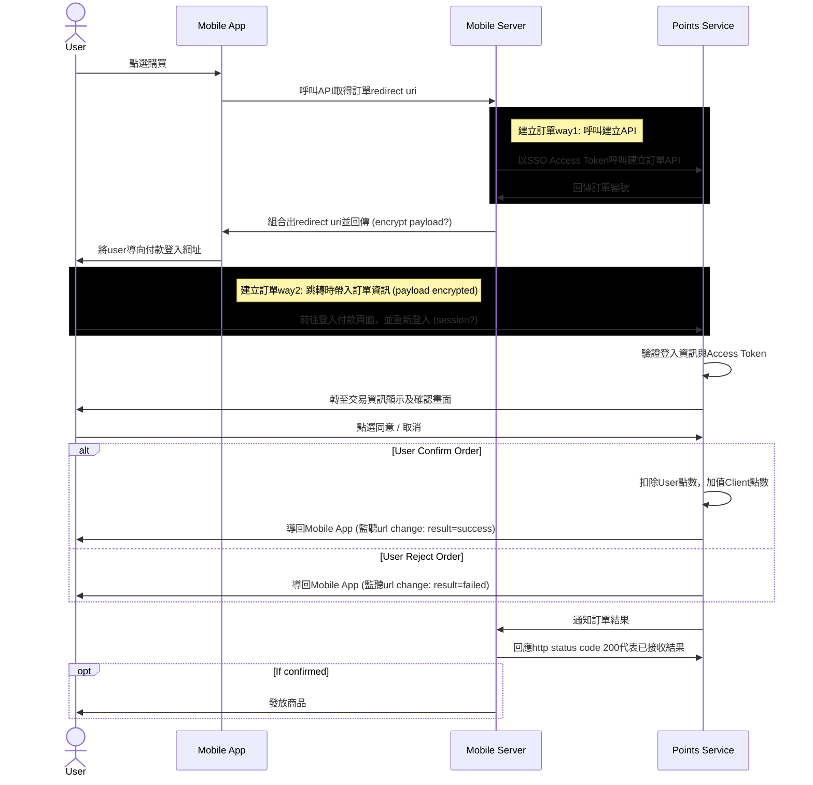

# End User Deposit / Withdraw Sequence Diagram

## [Non-SSO version] Deposit

```mermaid
  sequenceDiagram
    autonumber
    Actor User

    Mobile App       ->> Mobile Server : 呼叫server要求加點
    Mobile Server    ->> Points Service: 以OrderId & GameUserId呼叫 [建立訂單API]
    
    rect rgb(0,0,0) 
      alt GameUserId已綁定
        Points Service   ->> Points Service: 建立訂單，扣除Client點數，加值User點數
        Points Service   ->> Mobile Server : 回應成功訊息及我方OrderId
        Mobile Server    ->> User          : 通知user，End
      else GameUserId未綁定
        Points Service   ->> Mobile Server : 回傳未綁定之失敗訊息
        Mobile Server    ->> User          : 呼叫 [GameUserId綁定API] 將User跳轉至 [綁定 url]
        Note right of User                 : 重新走已綁定加值流程
      end
    end
```
---

## [Non-SSO version] Withdraw

```mermaid
sequenceDiagram
  Actor User
  User           ->> Mobile App    : 點選購買
  Mobile App     ->> Mobile Server : 呼叫API取得訂單redirect uri
  
  rect rgb(0,0,0)
    opt
      note right of Mobile Server: 建立訂單way1: 呼叫建立API
      Mobile Server  ->> Points Service: 以GameUserId呼叫 [建立訂單API]
      Points Service ->> Mobile Server : 回傳訂單編號
    end
  end

  Mobile Server  ->> Mobile App    : 組合出 [redirect url] 並回傳
  Mobile App     ->> User          : 將user導向付款redirect url

  rect rgb(0,0,0)
    note right of Mobile App: 建立訂單way2: 跳轉時帶入訂單資訊 (payload encrypted)
    User           ->> Points Service: 前往登入付款頁面
    opt GameUserId未綁定
      Points Service ->> User : 跳轉至帳號綁定頁面
      User           ->> Points Service: 註冊並完成綁定 
    end
  end

  Points Service ->> User          : 轉至交易資訊顯示及確認畫面
  User           ->> Points Service: 點選同意 / 取消

  alt User Confirm Order
    Points Service ->> Points Service: 扣除User點數，加值Client點數
    Points Service ->> User          : 導回Mobile App (監聽url change: result=success)
  else User Reject Order
    Points Service ->> User          : 導回Mobile App (監聽url change: result=failed)
  end
  Points Service   ->> Mobile Server : 通知訂單結果
  Mobile Server    ->> Points Service: 回應http status code 200代表已接收結果
  
  opt If confirmed
    Mobile Server  ->> User          : 發放商品
  end
```

---

## [SSO version] Deposit

```mermaid
  sequenceDiagram
    autonumber
    Actor User
    Mobile App       ->> Mobile Server : 呼叫API取得訂單
    Mobile Server    ->> Points Service: 以SSO Access Token呼叫建立訂單API
    Points Service   ->> Mobile Server : 通知訂單結果
    Mobile Server    ->> Points Service: 回應http status code 200代表已接收結果
    Mobile Server    ->> User          : 顯示更新後的餘額給User
```

---

## [SSO version] Withdraw

```mermaid
sequenceDiagram
  Actor User
  User           ->> Mobile App    : 點選購買
  Mobile App     ->> Mobile Server : 呼叫API取得訂單redirect uri
  
  rect rgb(0,0,0)
    note right of Mobile Server: 建立訂單way1: 呼叫建立API
    Mobile Server  ->> Points Service: 以SSO Access Token呼叫建立訂單API
    Points Service ->> Mobile Server : 回傳訂單編號
  end

  Mobile Server  ->> Mobile App    : 組合出redirect uri並回傳 (encrypt payload?)
  Mobile App     ->> User          : 將user導向付款登入網址

  rect rgb(0,0,0)
    note right of Mobile App: 建立訂單way2: 跳轉時帶入訂單資訊 (payload encrypted)
    User           ->> Points Service: 前往登入付款頁面，並重新登入 (session?)
  end

  Points Service ->> Points Service: 驗證登入資訊與Access Token
  Points Service ->> User          : 轉至交易資訊顯示及確認畫面
  User           ->> Points Service: 點選同意 / 取消

  alt User Confirm Order
    Points Service ->> Points Service: 扣除User點數，加值Client點數
    Points Service ->> User          : 導回Mobile App (監聽url change: result=success)
  else User Reject Order
    Points Service ->> User          : 導回Mobile App (監聽url change: result=failed)
  end
  Points Service   ->> Mobile Server : 通知訂單結果
  Mobile Server    ->> Points Service: 回應http status code 200代表已接收結果
  
  opt If confirmed
    Mobile Server  ->> User          : 發放商品
  end
```

